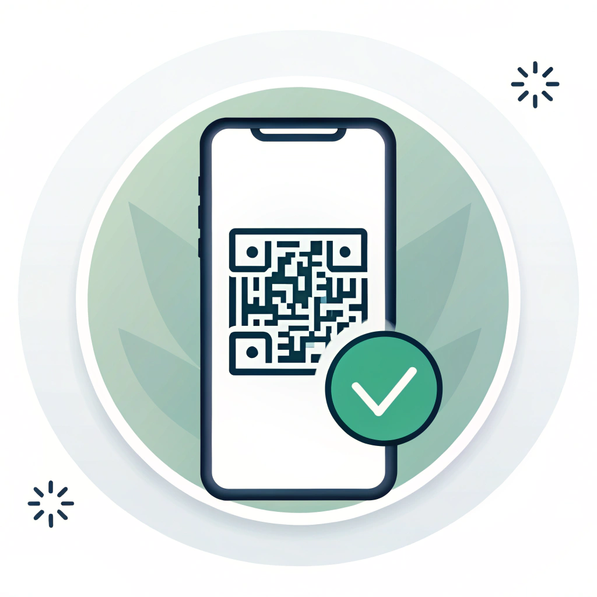

# MQ Pay



MQ Pay is a Flutter mobile payment assistant for Rwanda that streamlines MTN Mobile Money and Airtel eKash transactions. It generates USSD codes, dials them directly, listens for the SMS confirmation, and automatically marks each payment as confirmed or failed — giving you near-API-level transaction tracking without needing API access.

---

## Features

### Payments
- **Multi-step payment form** — enter amount and recipient in a guided flow
- **Shorthand amounts** — type `5k` for 5,000 or `2.5m` for 2,500,000 RWF
- **Quick presets** — one-tap amount chips (500, 1K, 2K, 5K … 100K)
- **MTN & Airtel auto-detection** — phone prefix determines the correct USSD format automatically
- **MoMo code support** — send to merchant MoMo codes (`*182*8*1*…`) with zero fee
- **Record-only mode** — log a payment you made outside the app (cash, manual dial, etc.)
- **Receive mode** — generate a QR code so someone can pay you the exact amount

### Transaction Tracking
- **Automatic SMS confirmation** — reads incoming Mobile Money SMS and matches them to pending transactions, marking them success or failed without manual intervention
- **USSD popup detection** — captures the USSD response dialog via Android Accessibility Service for instant status updates
- **Pending → resolved pipeline** — on app resume, retries matching any SMS that arrived while the app was backgrounded
- **Transaction history** — full log with status badges, fees, confirmation codes, date filtering, and reason tags
- **Loan tracking** — flag transactions as loans and mark them recovered
- **Edit / delete records** — correct any record after the fact

### Fee Calculation
- Live fee preview before you dial, using official MTN and Airtel tariff brackets
- Supports both MTN MoMo Phone and Airtel eKash tariff tables
- Fee toggle — exclude fee from a record if you didn't pay it yourself

### Contact & QR
- **Contact autocomplete** — searches your contacts and recent call log as you type
- **QR scanner** — scan a payment QR code to pre-fill recipient and amount
- **QR generator** — share your receive QR via any channel

### Backup & Cloud
- **Supabase cloud backup** — encrypted remote backup, keeps last 3 snapshots
- **Local file backup** — export / import as JSON or Excel (`.xlsx`)
- **Auto-backup** — runs automatically on a configurable schedule

### Reporting
- **Daily totals** — background WorkManager task sends a daily summary
- **Monthly breakdown** — history screen groups transactions by month with totals
- **Reason analytics** — track spending by custom reason tags

### UX
- **Multi-language** — English, French, Kinyarwanda, Swahili
- **Dark / Light theme**
- **Push notifications** — notifies you when a transaction status changes, with amount and recipient in the message

---

## USSD Code Formats

| Type | Format |
|---|---|
| MTN MoMo Phone | `*182*1*1*[phone]*[amount]#` |
| Airtel eKash | `*182*1*2*[phone]*[amount]#` |
| MoMo Code (merchant) | `*182*8*1*[code]*[amount]#` |

Phone prefix determines the network automatically: `078/079` → MTN, `072/073` → Airtel.

---

## Technology Stack

| Layer | Technology |
|---|---|
| Framework | Flutter 3.6.1+ / Dart 3.6+ |
| State management | Provider |
| Local storage | SharedPreferences |
| Cloud backup | Supabase Flutter |
| Firebase | Firebase Core, Cloud Firestore (daily totals) |
| Background tasks | WorkManager |
| SMS reading | flutter_sms_inbox |
| Notifications | flutter_local_notifications |
| QR | qr_flutter, mobile_scanner |
| Contacts | flutter_contacts |
| Call log | call_log |
| Dialer | flutter_phone_direct_caller |
| Excel export | excel |
| File picker | file_picker |
| Permissions | permission_handler |
| Env vars | flutter_dotenv |
| i18n | flutter_localizations, intl |

---

## Project Structure

```
lib/
├── helpers/
│   ├── app_theme.dart
│   ├── launcher.dart          # launchUSSD helper
│   ├── localProvider.dart
│   ├── safe_date_format.dart
│   └── theme_provider.dart
├── l10n/                      # ARB localization source files
├── generated/                 # Auto-generated localization classes
├── models/
│   ├── daily_total.dart
│   ├── tariff.dart            # Fee bracket definitions
│   ├── transaction_status.dart
│   └── ussd_record.dart       # Core transaction model
├── screens/
│   ├── edit_ussd_record_dialog.dart
│   ├── home.dart              # Payment form + receive mode
│   ├── qr_scanner_screen.dart
│   ├── settings.dart          # Payment methods, backup, preferences
│   └── ussd_records_screen.dart
├── services/
│   ├── backup_service.dart         # JSON / Excel local backup
│   ├── daily_total_service.dart    # WorkManager reporting
│   ├── notification_service.dart
│   ├── sms_listener_service.dart   # Polls inbox, deduplicates
│   ├── sms_parser_service.dart     # Parses MTN & Airtel SMS formats
│   ├── supabase_backup_service.dart
│   ├── tariff_service.dart
│   ├── transaction_matcher_service.dart  # Matches SMS to pending records
│   ├── ussd_detector_service.dart        # Accessibility Service bridge
│   ├── ussd_keyword_detector.dart        # Success/failure keyword list
│   ├── ussd_record_service.dart          # SharedPreferences persistence
│   └── ussd_transaction_manager.dart     # In-flight transaction state
├── widgets/
│   ├── accessibility_permission_card.dart
│   ├── scroll_indicator.dart
│   └── transaction_status_badge.dart
├── firebase_options.dart
└── main.dart
```

---

## Prerequisites

- Flutter SDK 3.6.1+
- Android SDK (Android-only; the USSD dialer and SMS reader are Android features)
- Firebase account
- Supabase project (optional — only required for cloud backup)

---

## Getting Started

### 1. Clone

```bash
git clone https://github.com/julesntare/mq_pay.git
cd mq_pay
```

### 2. Install dependencies

```bash
flutter pub get
```

### 3. Environment variables

Create a `.env` file in the project root:

```
SUPABASE_URL=https://your-project.supabase.co
SUPABASE_ANON_KEY=your-anon-key
```

Supabase is optional. If the keys are absent, cloud backup is simply disabled.

### 4. Firebase setup

1. Create a Firebase project at [console.firebase.google.com](https://console.firebase.google.com/)
2. Enable Firestore Database
3. Place `google-services.json` in `android/app/`
4. Run:

```bash
dart pub global activate flutterfire_cli
flutterfire configure
```

### 5. Generate localization files

```bash
flutter gen-l10n
```

### 6. Run

```bash
flutter run
```

Release build:
```bash
flutter build apk --release
```

---

## Android Permissions

The app requests the following permissions at runtime:

| Permission | Purpose |
|---|---|
| `READ_SMS` | Read Mobile Money confirmation SMS |
| `RECEIVE_SMS` | Detect incoming SMS in real time |
| `READ_CONTACTS` | Contact autocomplete |
| `READ_CALL_LOG` | Recent-call suggestions in recipient field |
| `BIND_ACCESSIBILITY_SERVICE` | Capture USSD popup text for instant status updates |

The accessibility service is optional — SMS-based confirmation works without it.

---

## Usage

### Sending money

1. Enter the amount (plain number or shorthand: `5k`, `2.5m`)
2. Enter the recipient phone number or MoMo code, or pick from contact suggestions
3. Tap **Next** — the app generates the correct USSD code and shows a fee breakdown
4. Tap **Dial** — the USSD is dialed automatically
5. Complete the transaction on your phone (enter PIN when prompted)
6. MQ Pay reads the confirmation SMS and marks the transaction ✓ or ✗

### Record-only mode

Switch to **Record Only** to log a payment you're about to make manually (or already made). The record is saved immediately as confirmed, with no USSD dialing.

### Receiving money

Switch to **Receive** mode, enter the amount, and share the generated QR. The payer scans it to pre-fill recipient and amount on their end.

### Transaction history

Tap the history icon to see all transactions grouped by month. Filter by date, recipient type, or reason tag. Tap any record to edit it.

### Backup

Go to **Settings → Backup**:
- **Local**: export to JSON or Excel, import from file
- **Supabase**: push / pull cloud backup (requires `.env` keys)
- Auto-backup runs on a configurable schedule

---

## Localization

Supported: English (`en`), French (`fr`), Kinyarwanda (`rw`), Swahili (`sw`).

To add a language:
1. Create `lib/l10n/intl_[code].arb`
2. Add translations
3. Run `flutter gen-l10n`
4. Add the locale to `supportedLocales` in `main.dart`

---

## Troubleshooting

**Build fails after `flutter pub get`**
```bash
flutter clean && flutter pub get && flutter run
```

**Transactions stay pending**
- Grant SMS permission in device settings
- Enable the MQ Pay Accessibility Service in *Settings → Accessibility*
- Open the app after completing the USSD — the retry scan runs on resume

**SMS not matched**
- Make sure the incoming SMS sender contains `mtn`, `m-money`, `airtel`, or `ekash`
- Check that the amount in the SMS matches the amount you entered (within 1 RWF)

**Supabase backup fails**
- Verify `SUPABASE_URL` and `SUPABASE_ANON_KEY` in `.env`
- Check Supabase project RLS policies

---

## Changelog

### Version 1.0.1
- Automatic SMS transaction confirmation (MTN + Airtel)
- USSD popup detection via Accessibility Service
- Shorthand amount input (5k, 2.5m)
- Supabase cloud backup
- Excel export
- Daily totals reporting
- Airtel eKash support
- Contact suggestions from recent call log
- Record-only and Receive modes
- Push notifications with transaction details

### Version 1.0.0
- Initial release
- USSD code generation and dialing
- QR code scanning and generation
- Transaction history
- Multi-language support
- Dark/Light theme

---

## License

MIT License — see [LICENSE](LICENSE) for details.
